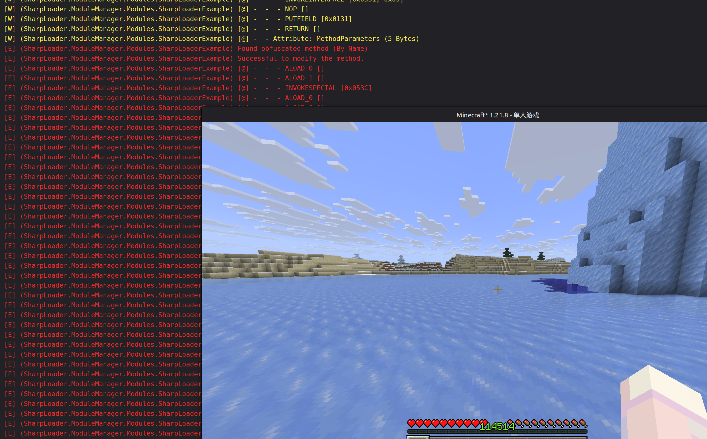

# Sharp Loader (Example Module)

> SharpLoader 示例模块（用于与“模组”区分）。

### 项目构成 (SharpLoader)

- [SharpLoader](github.com/YELANDAOKONG/SharpLoader2): 代替 Java.exe 启动虚拟机并载入模组；
- [SharpAgent](https://github.com/YELANDAOKONG/SharpAgent2): SharpLoader 的 Java Agent 代理部分；
- [SharpASM](https://github.com/YELANDAOKONG/SharpASM): 使用 C# 开发的 Java 字节码编辑工具；
- [SharpMixin](https://github.com/YELANDAOKONG/SharpMixin): 让字节码修改更加简单；
- [SharpAPI](https://github.com/YELANDAOKONG/SharpAPI2): 模块开发 API 及工具；
- [SharpPackage](https://github.com/YELANDAOKONG/SharpPackage): 模块打包构建 (MSBuild)；


```json
{
  "Id": "SharpLoaderExample",
  "Namespace": "SharpLoaderExample",

  "Version": {
    "Major": 1,
    "Minor": 0,
    "Patch": 0
  },
  "EntryPoint": "SharpLoaderExample.dll",
  "MainClass": "SharpLoaderExample.ModuleMain",
  "NativeDependencies": [
    "SharpAPI.dll"
  ],
  "Dependencies": [
    {
      "ModuleId": "SharpAPI"
    }
  ],
  "Title": "SharpLoader Example",
  "Description": "Sharp Loader Example Module",
  "Authors": [
    "You"
  ]
}
```

## 效果

使用 SharpASM 修改了玩家实体的 `readCustomData` 方法，并在方法返回前修改 `this.experienceLevel` 为 `114514`。



> 插入的字节码：

```text
[@] - ALOAD_0 [] 
[@] - LDC_W [0x0C07] 
[@] - PUTFIELD [0x0C0A] 
[@] - RETURN [] 
```

```csharp
codes.RemoveAt(codes.Count - 1); // 删除原有 RETURN 
codes.Add(new Code(OperationCode.ALOAD_0)); // 插入字节码...
codes.Add(new Code(OperationCode.LDC_W, new[] { Operand.WideIndex(newIndex) }));
codes.Add(new Code(OperationCode.PUTFIELD, new[] { Operand.FieldRef(fieldRefIndex) }));
codes.Add(new Code(OperationCode.RETURN));
```

